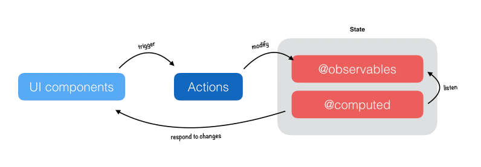

# TODOLIST 实验厂

最简单的业务尝试各种新奇技术。

## todolist-simple

写下人生中第一段React代码，主要利用create-react-app搭建一个最简单的项目，也没有任何的数据层的管理框架。第一个用 React 写的Todolist，我还是一个什么都不懂的小白，还是在2019年的九月，在这之前我写过两年的vue，对于vue的感情也算深厚，但随着对React的广泛使用和深入了解，我发现自己渐渐无法自拔。

## todolist-redux

`SPA` 的应用一般都是需要数据层框架的配合，尤其是复杂的项目，对于数据管理尤其重要。

`redux` 作为一个数据管理层框架，它的数据管理的思想来源于 `Flux` ，从 `Flux` 经典的“单项数据流”衍生出一大批优秀的数据管理框架。它的 `view` 、 `action` 、 `dispatcher` 、 `store` 的概念也被 `redux` 经典的实现了。虽然也有诸如 `mobx` 等优秀框架，但是毫无疑问的， `redux` 和 `react` 的搭配是一个无法避免，确实也十分好用的组合。

## todolist-redux-thunk

虽然 `redux` 作为数据管理层框架已然很优秀，但是实际开发中总是避免不了处理异步问题，在 `redux` 中我们推崇的函数式的编程范式，推崇纯函数的使用，这样带来的好处就是对数据变化的可追踪。

另外一方面，我们需要搭配 `redux` 的中间件专门解决异步问题， `thunk` 作为 `redux` 的中间，专门用来解决异步，而且使用起来十分简单。

## todolist-redux-saga

虽然 `redux-thunk` 很好用，但是 `redux-saga` 的实现却更加的强大，使用过 `redux-saga` 的同学，应该被它丰富的 `API` 所震惊，只要用上一次，就一定会爱上它。

## todolist-mobx-ts

`redux` 虽然很优秀，但是可能缺乏一点灵活度，尤其是单一组件存在复杂的数据类型需要管理，创建大量的 `action` 和频繁调用大量的 `dispatch` 函数让人疲于奔命。这时候灵活的 `mobx` 可能用起来更得心应手。

另外使用 `TypeScript` 也是这个todolist系列新增的。客观上讲， `TS` 的运用确实增加了部分代码量，主要在于各种 interface 类型的声明，但是考虑大型项目的迭代，以及 `JavaScript` 动态类型带来的隐患， `TS` 是提升项目可迭代性的最有利武器。

一个很深的感触是，纯 `JavaScript` 的 `react` 项目开发完后，跑起来总是避免不了一些小问题，但是基于 `TypeScript` 的 `react` 项目大部分时候都能让我无错启动项目。